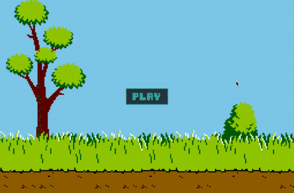

# Play now! [Duck Hunt](https://vh71886.github.io/Duck-Hunt/)

# Background
Duck Hunt is an 80's retro game where the player takes Dog to go duck hunting. In this project to create a clone of the game, the player will "hunt" the flying ducks using their mouse or trackpad. Points are given for successful hunts and the player has limited ammo. The game is over when time runs out, the user runs out of ammo or all ducks are hunted.

# Functionality
In Duck Hunt, users will be able to:
* Use a trackpad or mouse click to hunt a duck
* Gain points when successfully hunting
* Lose ammo per hunt attempt
* Lose the game if the time limit runs out

In addition, this project will include:
* Sound effects
* Mute and unmute sound effects

# Wireframes

# Technologies, Libraries, APIs
* Canvas API
* Animations
* Javascript
* HTML5 with CSS3

# Timeline
## Day 0: Planning and Research
Plan the project timeline, tasks, and search for assets. The assets will include sprites for the birds and the Dog. Research how to animate using sprite sheets and how to add sound effects.
- [X] General HTML Canvas research

## Day 1: Research and Setup
Continue any remaining research from Day 0 and begin the project setup. 
- [X] Complete skeleton setup
- [X] Animating with sprite sheets
- [X] Adding sound
- [X] Collision detection on click event

## Day 2: Set Up Classes and Properties
Create classes for the UI, the Dog, bird objects, the timer, the life count and the score.
- [X] Render canvas and background
- [X] Render navigation bar and control buttons
- [X] Render the duck objects (w/o event handling)
- [X] Render dog object (w/o event handling)
- [X] Render the timer, life count and score count
    - Graphics only, not operational at this time

## Day 3 - 5: All Game Logic
Work on all the game logic.
- [X] Bird movement logic
- [X] Event handling logic
- [X] Game play logic
    - Points for successful hunt
    - Game-over logic
        - Missed hunts
        - Timer reaches zero
- [X] Sound effects

## Day 6: Finish Up Overall Project
- [X] Complete any lingering tasks
- [ ] Add bonus features if time allows
- [X] Deploy website

## Day 7: Polish and Shine
Make it pretty, make it glow.
- [X] Clean up code
- [X] Clean up UI

# Bonus Features
- [ ] Crossover with other game characters
    - Lose points if they are hunted
- [ ] Power-ups to regain ammo/time
- [ ] Add top 3 score board

# Project Checklist
The live project:
- [X] Link to portfolio website, Github account, LinkedIn account
- [X] Landing page/modal with clear instructions
- [X] Interactive
- [X] Styled, clean frontend
- [X] Ability to mute any sound effects

Production README:
- [X] Link to live project 
- [X] Instructions to play or interact with the project
- [X] List of technologies, libraries, APIs used
- [ ] Technical implementation details with clean code snippets
- [X] To-dos and future features
- [X] No .DS_store files, debugger, console.logs
- [X] Organized file structure with /src and /dist directories